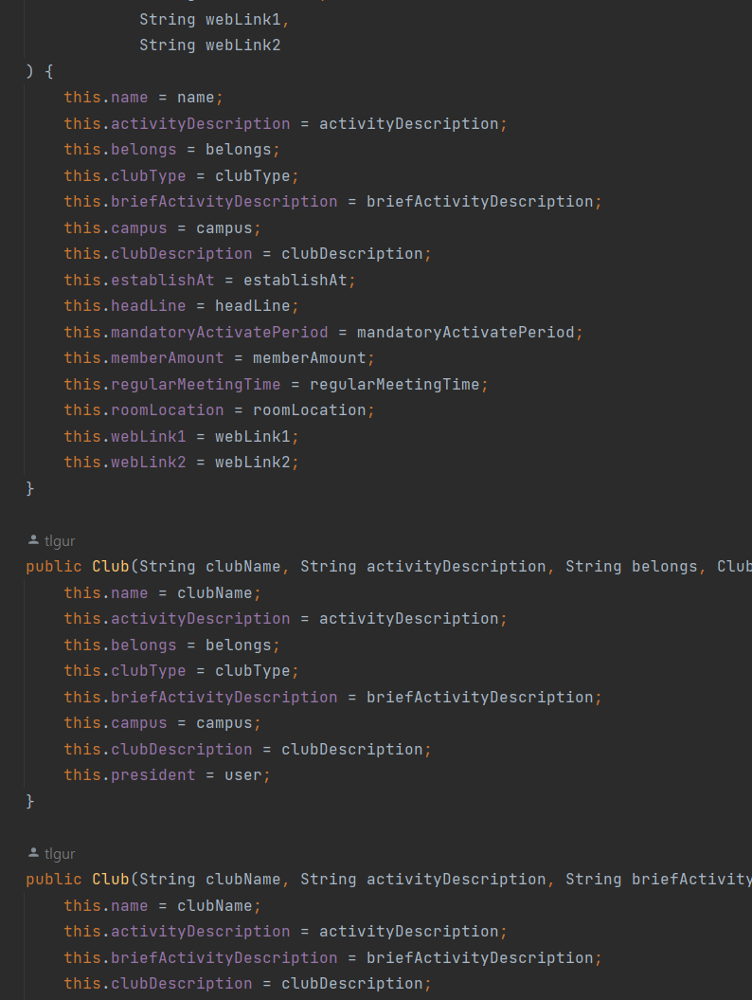

# 빌더는 신이다

### 기존에 안썼던 이유

 #### Setter, NoArgsConstructor를 열어줘야 함
  - 틀렸음  
  - Lombok.@Builder 기준, 내부 클래스를 만들고 내부 클래스 + AllArgsConstructor 사용  
  - https://cobbybb.tistory.com/14
  - https://blog.leocat.kr/notes/2018/09/02/lombok-using-builder-and-noargsconstructor-together

#### 특정 필드를 빼도 되는가? 무결성 위반?
  - Builder를 이용해서 초기화를 하면 개발자 혹은 팀원이 특정 필드를 null로 초기화할(빠뜨릴) 가능성이 있다고 생각했음  
  - Optional의 경우 파라미터로 Optional을 말아서 넣어줘야 하는 것이 매우*2 불편(ANTI)  
    -> 이 문제의 경우, return값이 Optional로 wrapped된 getter를 작성하는 것으로 해결  
    -> Optional Property 자체가 적절하지 않다고 판단

### VS 생성자
 - 생성자 단점  
    1. 너무 많이 만들어야 함  
     - Nullable한 필드가 많을 경우, 생성자에 NULL을 패싱하거나(ANTI) 혹은 각 경우의 수별로 생성자를 만들거나(가독성 크게 해침), 혹은 Setter를 열어야 한다(ANTI)  
     혐오감 MAX 생성자
     
    2. 1번으로 인해 관리가 매우 힘들어짐, 만들었는지 기억도 안남 + 테스트 환경에서 잦은 Reflection 호출  
 - Builder 등장   
    - Custom builder() : https://stackoverflow.com/questions/29885428/required-arguments-with-a-lombok-builder  

    - PK와 같이 AllArgs에 들어가면 안되는 것들? : @Builder.Default + custom builder()  
    - 무결성? : custom builder를 유사 생성자 처럼 사용 (but, 기존 builder의 접근 제어자를 제한 할 수 없다는 것이 아쉬운듯)

### 종합
```java
@Entity
@Getter
@Builder(builderMethodName = "hiddenBuilder")
@NoArgsConstructor(access = PROTECTED)
@AllArgsConstructor
public class ClubMeta extends BaseEntity {
    @Id
    @GeneratedValue(strategy = IDENTITY)
    @Column(name = "club_meta_id")
    @Builder.Default
    private Long id = null;

    private String name;
    private String activityType;

    @Lob
    private String description;
    @Lob
    private String activityDescription;

    private Integer establishAt;

    @OneToOne
    @JoinColumn(name = "logo_id")
    private Logo logo;

    public Optional<Integer> getEstablishAt() {
        return Optional.ofNullable(establishAt);
    }

    public Optional<Logo> getLogo() {
        return Optional.ofNullable(logo);
    }

    public ClubMetaBuilder builder(String name, String activityType, String description, String activityDescription) {
        return hiddenBuilder()
                .id(null)
                .name(name)
                .activityType(activityType)
                .description(description)
                .activityDescription(activityDescription);
    }
}

```